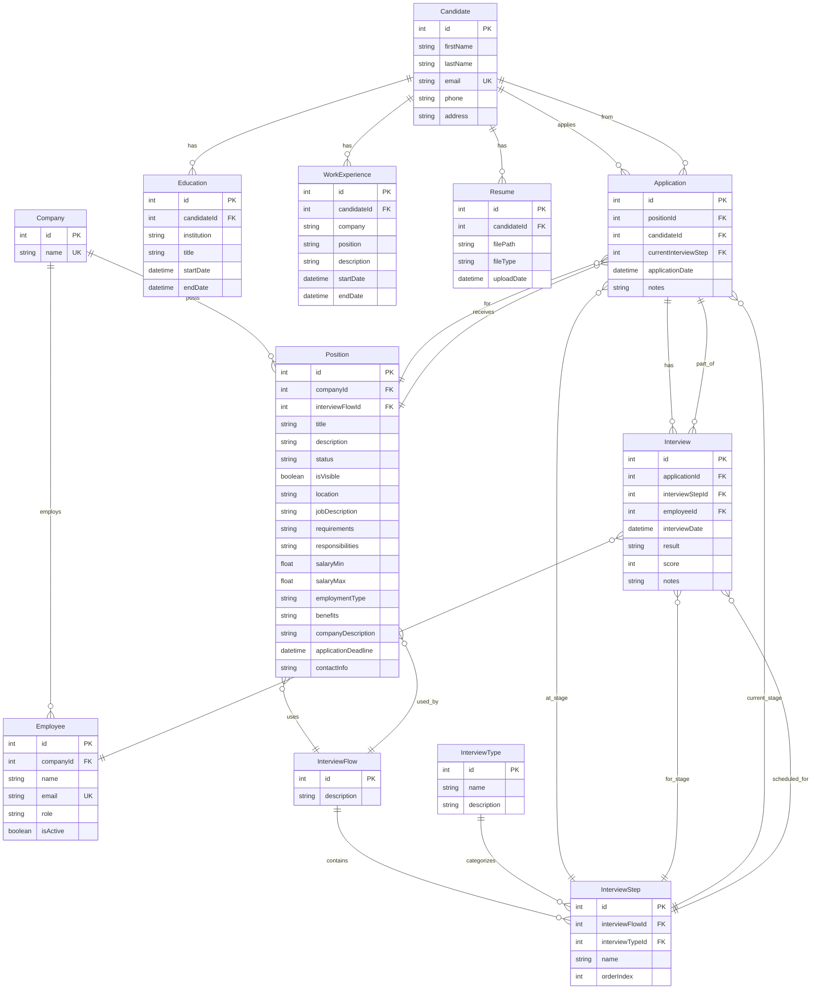

# LTI Database Schema Documentation

## Overview

The LTI (Talent Tracking System) database is designed using PostgreSQL with Prisma ORM. The schema follows Domain-Driven Design principles and supports a comprehensive recruitment management workflow from candidate registration through the entire interview process.

## Core Domain Entities

### **Candidate Management**
- **Candidate**: Core entity storing personal information
- **Education**: Academic background and qualifications
- **WorkExperience**: Professional work history
- **Resume**: Document storage for candidate files

### **Company & Position Management**
- **Company**: Organizations posting job positions
- **Employee**: Company staff members who conduct interviews
- **Position**: Job openings with detailed requirements

### **Interview Process Management**
- **InterviewFlow**: Configurable multi-stage interview processes
- **InterviewType**: Categories of interview types (technical, behavioral, etc.)
- **InterviewStep**: Individual stages within an interview flow
- **Application**: Candidate applications to specific positions
- **Interview**: Actual interview sessions with scoring

## Entity Relationship Diagram



## Key Relationships Explained

### **Candidate Journey Flow**
1. **Candidate** creates profile with personal information
2. **Education** and **WorkExperience** records provide background
3. **Resume** files are uploaded and stored
4. **Application** is created for a specific **Position**
5. Application moves through **InterviewStep** stages
6. **Interview** sessions are conducted and scored

### **Company & Position Setup**
1. **Company** registers in the system
2. **Employee** accounts are created for company staff
3. **Position** is posted with job details
4. **InterviewFlow** is configured with multiple **InterviewStep**s
5. Each **InterviewStep** is categorized by **InterviewType**

### **Interview Process Flow**
1. **Application** starts at first **InterviewStep** (orderIndex = 1)
2. **Interview** sessions are scheduled and conducted
3. **Employee** (interviewer) provides scores and notes
4. Application progresses to next **InterviewStep** based on results
5. Process continues until final hiring decision

## Critical Business Rules

### **Application State Management**
- `Application.currentInterviewStep` always references a valid `InterviewStep.id`
- Applications can only move forward/backward within the same `InterviewFlow`
- Each `Application` maintains history through `Interview` records

### **Interview Flow Configuration**
- `InterviewStep.orderIndex` determines the sequence within an `InterviewFlow`
- Multiple `InterviewStep`s can have the same `InterviewType` (e.g., multiple technical rounds)
- `InterviewFlow` can be reused across multiple `Position`s

### **Data Integrity Constraints**
- `Candidate.email` must be unique across the system
- `Company.name` must be unique
- `Employee.email` must be unique
- `Application` combination of `candidateId` + `positionId` should be unique

## Common Query Patterns

### **Position Board Data (Kanban View)**
```sql
-- Get all candidates for a position grouped by interview stage
SELECT 
    c.id as candidateId,
    c.firstName || ' ' || c.lastName as fullName,
    a.currentInterviewStep,
    is.name as currentInterviewStepName,
    AVG(i.score) as averageScore
FROM Application a
JOIN Candidate c ON a.candidateId = c.id
JOIN InterviewStep is ON a.currentInterviewStep = is.id
LEFT JOIN Interview i ON a.id = i.applicationId
WHERE a.positionId = ?
GROUP BY c.id, a.currentInterviewStep, is.name
ORDER BY is.orderIndex, c.lastName
```

### **Interview Flow Setup**
```sql
-- Get complete interview flow for a position
SELECT 
    p.title as positionTitle,
    if.description as flowDescription,
    is.id as stepId,
    is.name as stepName,
    is.orderIndex,
    it.name as interviewType
FROM Position p
JOIN InterviewFlow if ON p.interviewFlowId = if.id
JOIN InterviewStep is ON if.id = is.interviewFlowId
JOIN InterviewType it ON is.interviewTypeId = it.id
WHERE p.id = ?
ORDER BY is.orderIndex
```

## Performance Considerations

### **Recommended Indexes**
```sql
-- Frequently queried foreign keys
CREATE INDEX idx_application_position ON Application(positionId);
CREATE INDEX idx_application_candidate ON Application(candidateId);
CREATE INDEX idx_application_current_step ON Application(currentInterviewStep);

-- Email lookups
CREATE INDEX idx_candidate_email ON Candidate(email);
CREATE INDEX idx_employee_email ON Employee(email);

-- Interview flow queries
CREATE INDEX idx_interview_step_flow ON InterviewStep(interviewFlowId);
CREATE INDEX idx_interview_step_order ON InterviewStep(interviewFlowId, orderIndex);

-- Date-based queries
CREATE INDEX idx_interview_date ON Interview(interviewDate);
CREATE INDEX idx_application_date ON Application(applicationDate);
```

### **Query Optimization Notes**
- Use `JOIN` instead of multiple queries for position board data
- Consider caching `InterviewFlow` configurations as they change infrequently
- Implement pagination for large candidate lists
- Use database-level constraints to maintain referential integrity

## Security & Privacy Considerations

### **Sensitive Data Fields**
- `Candidate.email`, `Candidate.phone`, `Candidate.address` - PII data
- `Resume.filePath` - Contains uploaded documents
- `Interview.notes` - May contain sensitive evaluation comments
- `Employee.email` - Internal company information

### **Access Control Patterns**
- Company employees can only access their company's positions and candidates
- Candidates can only view their own application status
- Interviewers can only access applications for positions they're assigned to
- HR administrators have broader access within their company scope

## Migration & Evolution Strategy

### **Schema Versioning**
- All schema changes managed through Prisma migrations
- Backward compatibility maintained for API consumers
- Database constraints enforce business rules at the data level

### **Future Enhancements**
- **Audit Trail**: Add `created_at`, `updated_at`, `created_by` fields
- **Soft Deletes**: Add `deleted_at` fields for important entities
- **Multi-tenancy**: Add `tenant_id` for enterprise customers
- **Workflow Automation**: Add trigger and action configuration tables
