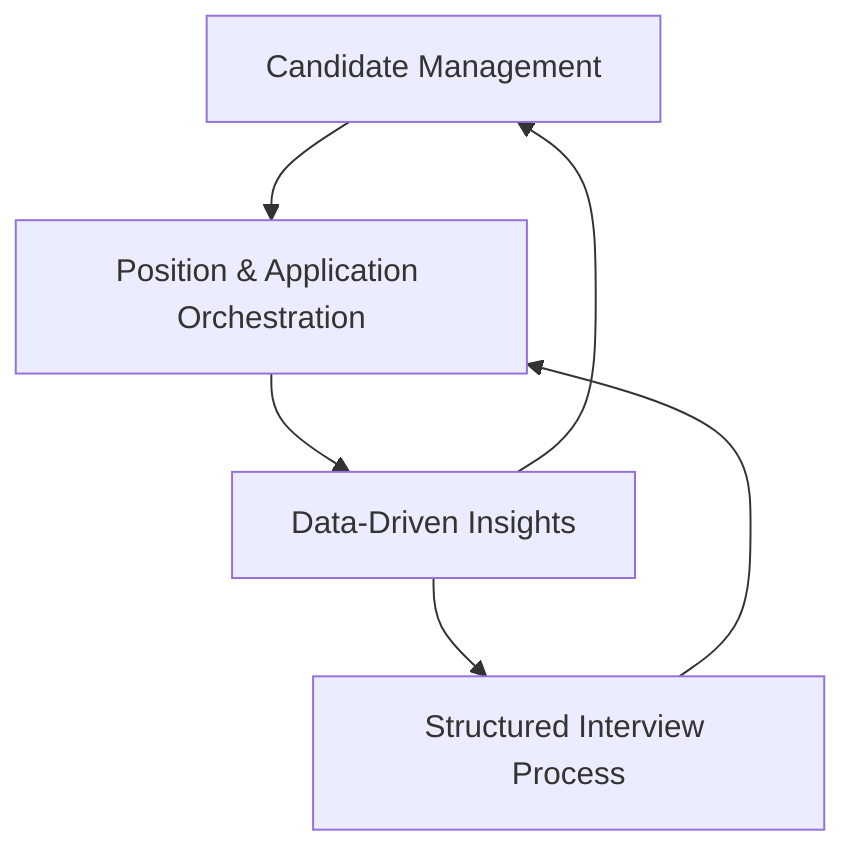

# LTI Product Pillars

## Core Product Pillars

### 1. **Candidate Management Excellence** 🎯
**Vision:** Provide comprehensive, intuitive candidate lifecycle management

**Key Principles:**
- **Complete Candidate Profiles** - Education, work experience, skills, and document management
- **Data Integrity** - Robust validation and consistent data quality
- **User Experience** - Intuitive forms and interfaces for efficient data entry
- **Document Management** - Secure file handling for resumes and supporting documents

**Success Metrics:**
- Candidate profile completion rate > 95%
- Data entry time reduction by 60%
- Zero data loss incidents
- Resume upload success rate > 99%

---

### 2. **Structured Interview Process** 📋
**Vision:** Enable configurable, standardized interview workflows that improve hiring quality

**Key Principles:**
- **Configurable Flows** - Flexible interview stages adaptable to different positions
- **Standardized Evaluation** - Consistent scoring and assessment criteria
- **Process Transparency** - Clear visibility into interview progress and decisions
- **Quality Assurance** - Built-in checks and balances for fair evaluation

**Success Metrics:**
- Interview process standardization across 100% of positions
- Average interview quality score improvement by 40%
- Time-to-decision reduction by 50%
- Interviewer satisfaction rating > 4.5/5

---

### 3. **Position & Application Orchestration** 🔄
**Vision:** Seamlessly connect candidates with opportunities through intelligent matching and tracking

**Key Principles:**
- **Comprehensive Position Management** - Detailed job descriptions with requirements and benefits
- **Application Lifecycle Tracking** - Real-time status updates and progress monitoring
- **Intelligent Matching** - Algorithm-driven candidate-position recommendations
- **Workflow Automation** - Reduced manual tasks through smart automation

**Success Metrics:**
- Position-candidate match accuracy > 85%
- Application processing time reduction by 70%
- Automated workflow coverage for 90% of routine tasks
- Candidate-position fit satisfaction > 4.0/5

---

### 4. **Data-Driven Insights** 📊
**Vision:** Transform recruitment from intuition-based to data-driven decision making

**Key Principles:**
- **Performance Analytics** - Comprehensive metrics on recruitment effectiveness
- **Predictive Insights** - Data-driven recommendations for hiring success
- **Bias Reduction** - Analytics to identify and minimize unconscious bias
- **Continuous Improvement** - Feedback loops for process optimization

**Success Metrics:**
- Hiring success rate improvement by 35%
- Bias indicator reduction by 60%
- Data-driven decision rate > 80%
- ROI visibility for all recruitment activities

---

## Cross-Cutting Principles

### **Security & Privacy** 🔒
- GDPR compliance and data protection
- Secure authentication and authorization
- Audit trails for all sensitive operations
- Regular security assessments and updates

### **Scalability & Performance** ⚡
- Sub-2-second response times for all operations
- Support for enterprise-scale datasets (10,000+ candidates)
- Efficient database queries and caching strategies
- Horizontal scaling capabilities

### **User Experience** 💫
- Intuitive, mobile-responsive interfaces
- Minimal learning curve for new users
- Accessibility compliance (WCAG 2.1)
- Consistent design language across all features

### **Integration & Flexibility** 🔧
- API-first architecture for third-party integrations
- Configurable workflows and business rules
- Multi-tenant architecture for enterprise clients
- Standards-based protocols for interoperability

## Pillar Interdependencies

**Strategic Alignment:**
- **Candidate Management** provides the foundation data for all other pillars
- **Interview Process** ensures quality and consistency in evaluation
- **Application Orchestration** connects candidates with opportunities efficiently
- **Data-Driven Insights** feeds back into all pillars for continuous improvement

## Success Framework

### **Phase 1: Foundation** (Current)
Focus on pillars 1 & 2 - establishing robust candidate management and interview processes

### **Phase 2: Optimization** (Next 3-6 months)
Enhance pillar 3 with advanced application orchestration and workflow automation

### **Phase 3: Intelligence** (6-12 months)
Fully realize pillar 4 with comprehensive analytics and predictive capabilities

### **Phase 4: Scale** (12+ months)
Enterprise-grade implementation of all pillars with advanced integrations and AI capabilities
